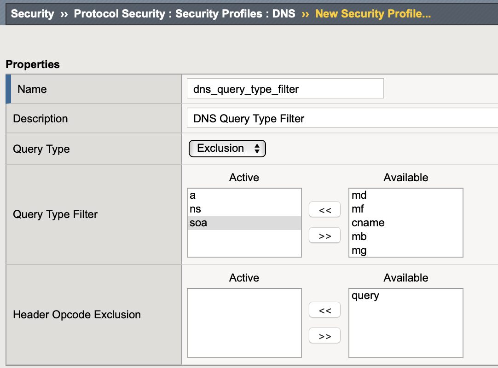
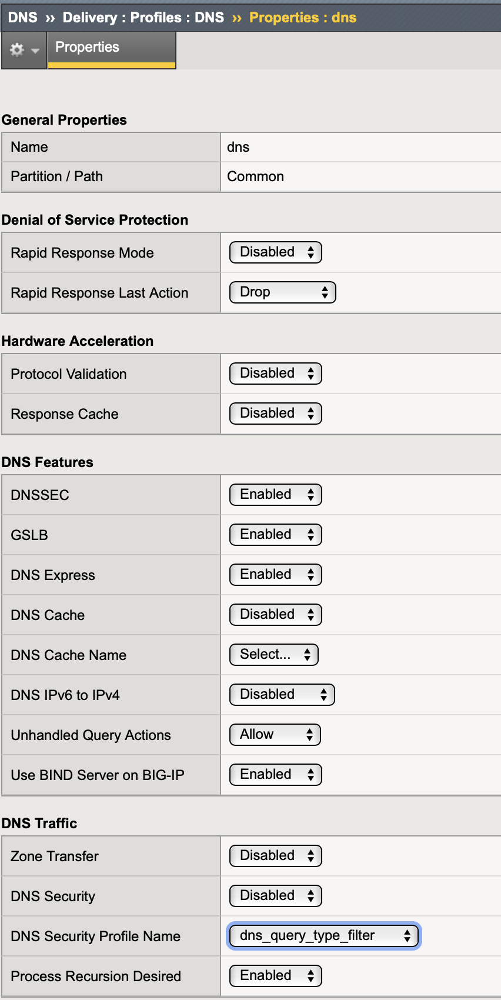
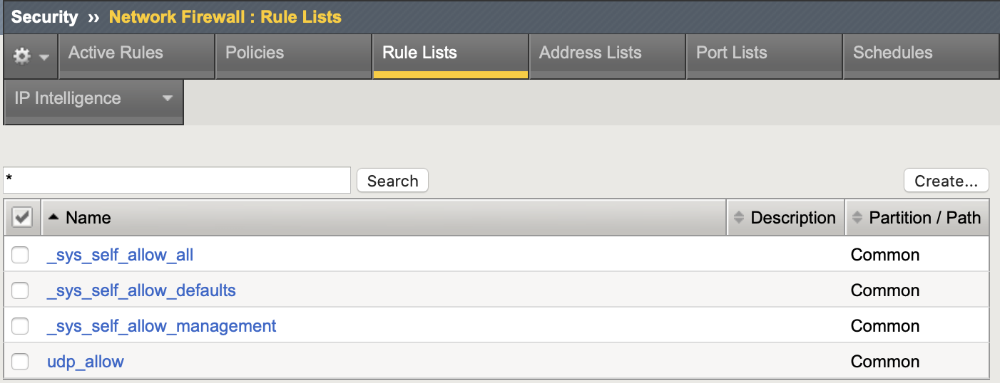
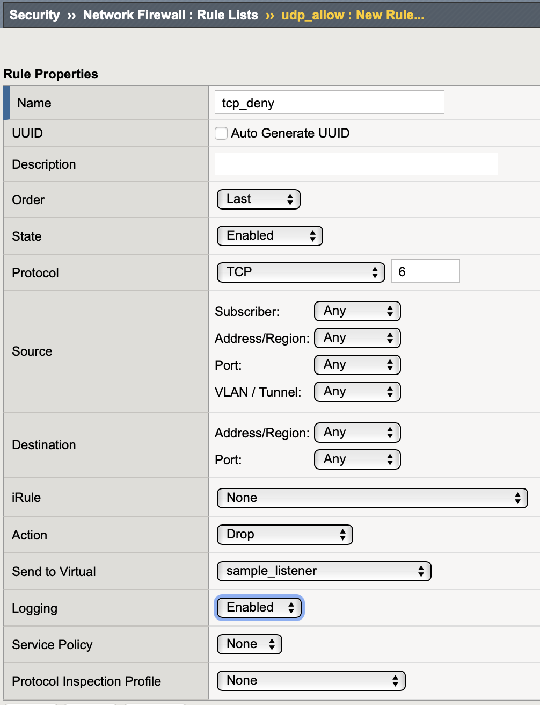

= BIG-IP AFM
:toc: manual

== 业务价值

TODO

== 功能点演示

=== 协议安全 - DNS请求类型的控制

*1. 配置AFM，定义dns允许查询的记录类型*

NOTE: 如上定义允许soa，ns，a记录类型的查询，不允许其它记录类型的查询。

*2. 关联到 DNS profiles*

[source, bash]
.*3. 测试*
----

----

=== 网络防火墙 - 规则控制

本部分进行 UDP 协议类型的控制

*1. 配置F5 AFM 针对UDP协议以及其他协议的策略*

选择 `Security`  ->  `Network Firewall`  ->  `Rule Lists`，点击 `Create` 按钮创建一个网络防火墙规则，命名为 `udp_allow`，

*2. 编辑防火墙规则*

在网络防火墙规则列表中点击 `udp_allow`，编辑防火墙规则。

添加规则 `udp_allow`:

添加规则 `tcp_deny`:

[source, bash]
*3. 测试*
----
// udp request
$ dig example.com @10.1.10.50 +short
10.1.10.40

// tcp request

----

