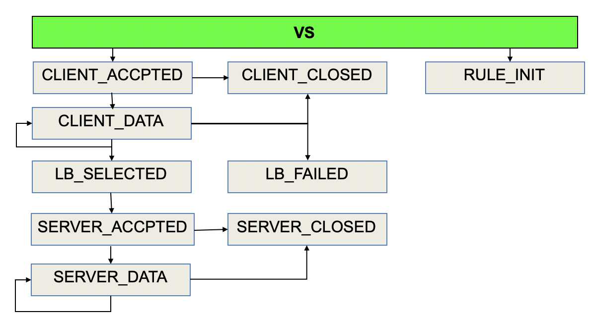

= iRules
:toc: manual

== 概述

* Rules 的处理必须依赖于 VS 对流量的接收，通过事件触发机制，Rules 可以控制流量在 VS 内部处理的整个过程。
* 大部分 rules 只在同一个 VS 之内有效，Rules 内创建的变量以连接为生命周期，一个VS上可以有多个 Rules，它们将被顺序执行。
* iRules 基于TCL(Tool Command Language)

== 语法

=== Comments

[source, bash]
----
when HTTP_REQUEST {

    # This is comments
}
----

=== Event

*常见 Event:*

*Event 使用语法*

[source, bash]
----
when HTTP_REQUEST {
    log local0. "The requested URI is [HTTP::uri]"
}
----

*Event Query Options*

[cols="2,2,5a"]
|===
|Event |Data Type |Items

|CLIENT_ACCEPTED
|IP Data
|
* source address
* destination address
* IP protocol value
* number of packets
* time to live

|CLIENT_ACCEPTED
|TCP Data
|
* client port
* server port
* payload
* bandwidth

|CLIENT_ACCEPTED
|Route Data
|
* age
* routing domain
* round-trip time
* bandwidth

|HTTP_REQUEST
|HTTP Data
|
* header
* host
* method
* URI
* version

|HTTP_REQUEST
|SSL Data
|
* cert content
* cipher
* extensions
* payload
* session ID

|LB_SELECTED
|LB_Data
|
* server info
* SNAT
* status
* queue

|HTTP_RESPONSE
|HTTP_Data
|
* data
* cookie
* header
* payload
* status code
|===

=== Variables

[source, bash]
.*set, unset, substitution, concatenation*
----
when HTTP_REQUEST {

    set my_broswer  "Google Chrome"
    
    log local0. $my_broswer
    log local0. "The user's broswer is $my_broswer"
    
    unset my_broswer
}
----

[source, bash]
.*Four Data Types*
----
when HTTP_REQUEST {

    # Numner
    set my_num 5
    set my_decimal 2.5
    
    # String
    set my_name "Kylin"
    set my_company "F5 Networks"
    
    # Booleans
    set isTcp true
    set isClose yes
    
    # List
    set num_list {1, 3, 5, 7}
    set fruit_list {"apple", "orange", "banana"}
    set mixed_list {12, 20.75, "Beijing", true}
}
----

=== Append, Incremen

[source, bash]
----
when HTTP_REQUEST {
    # append
    set my_var "Hello"
    append my_var " World"
    log local0. $my_var
    
    # incr
    set my_num 10
    incr my_num 10
    incr my_num -25
    log local0. $my_num
}
----

=== Expression

[source, bash]
----
when HTTP_REQUEST {
    # expr
    set num_1 2
    set num_2 5
    set total [expr $num_1 + $num_2]
    
    log local0. $total
}
----

=== Mathematical Operators

[source, bash]
.*+ - * /*
----
when HTTP_REQUEST {
    
    set the_price 10000
    set the_discount 7500
    
    log local0. "Cost is $the_price with a discount of $the_discount"
    
    # -
    set updated_price [expr {$the_price - $the_discount}]
    log local0. "The new cost is $updated_price"
    
    # *
    set the_tax [expr {$updated_price * .09}]
    log local0. "The 9% tax is $the_tax"
    
    # +
    set total_price [expr {$updated_price + $the_tax}]
    log local0. "Total price is $total_price"
    
    # /
    set monthly_payment [expr {$total_price / 12}]
    log local0. "Monthly payment is $monthly_payment"
}
----

=== Commands

[source, bash]
.*Command 一般语法*
----
<command name> <argument>
----

[cols="2,5a"]
|===
|Command |Example

|set
|
[source, bash]
----
set my_var "hello"
----

|unset
|
[source, bash]
----
unset my_var
----

|log
|
[source, bash]
----
log local0. "hello"
----

|pool
|
[source, bash]
----
pool http_pool
----

|expr
|
[source, bash]
----
expr {$my_num + 1}
----

|STREAM::expression 
|
[source, bash]
----
STREAM::expression "@original@replcaement@"
STREAM::expression "@original 1@replcaement 1@ @original 2@replcaement 2@"
----

|STREAM::enable
|
[source, bash]
----
STREAM::enable
----
|===

=== if else

[source, bash]
----
when HTTP_REQUEST {
    
    if { [HTTP::header User-Agent] contains "Bot"} {
        pool bot_pool
    } elseif { [HTTP::header User-Agent] contains "Curl"} {
        pool curl_pool
    } elseif { [HTTP::header User-Agent] contains "Chrome" } {
        pool chrome_pool
    } else {
        pool http_pool
    }
}
----

=== Comparison Operators

[source, bash]
----
when HTTP_REQUEST {
    
    set my_var "hello"
    set my_num 12
    
    if { $my_var eq "hello"} { }
    
    if { $my_var ne "world"} { }
    
    if { $my_num == 12} { }
    
    if { $my_num != 10} { }
    
    if { $my_num < 15} { }
    
    if { $my_num >= 12} { }
}
----

=== Logical Operators

[source, bash]
----
when HTTP_REQUEST {
    
    set my_var "hello"
    set my_num 12
    
    if { ($my_var eq "hello") and {$my_num >= 12}} { 
    
    } elseif { ($my_var eq "hello") or {$my_num >= 12} } {
    
    }
}
----

=== Relational Operators

[source, bash]
----
when HTTP_REQUEST {
    
    set client_ip [IP::client_addr]
    
    if { $client_ip starts_with "10.1"} { } 
    
    if { $client_ip equals "10.1.10.20"} { } 
    
    if { $client_ip ends_with "10.20"} { } 
    
    if { $client_ip contains ".10."} { } 
}
----

=== switch

[source, bash]
----
when HTTP_REQUEST {
    
    set client_ip [IP::client_addr]
    
    switch -glob $client_ip {
        "10.1.10.?" { }
        "10.1.10.[1-20]" { }
        "10.1.10.*" { }
        default { }
    }
}
----

NOTE: `-glob` 允许使用通配符。

* *?* - 任意一个字符
* *[]* - 一个范围内的值
* *** - 任意字符（可是多个）

=== Dash Argument

[source, bash]
----
when HTTP_REQUEST {
    
    set http_uri [HTTP::uri]
    
    switch -glob $client_ip {
        "*.jgp" - 
        "*.png" -
        "*.git" { }
        "*.txt" -
        "*.php" -
        "*.jsp" { }
        default { }
    }
}
----

=== List

[source, bash]
.*Define *
----
when HTTP_REQUEST {
    set my_list [list "abc" 123 true no "F5" 255]
}
----

[source, bash]
.*split llength lsort lindex lsearch*
----
when HTTP_REQUEST {

    set header_list [split [HTTP::header names] " "]
    
    set num_items [llength $header_list]
    
    set new_header_list [lsort $header_list]
    
    set third_item [lindex $new_header_list 2]
    
    set user_agent [lsearch $new_header_list "User-Agent"]
}
----

[source, bash]
.*foreach*
----
when HTTP_REQUEST {

    set my_list [list "abc" 123 true no "F5" 255]
    
    foreach x $my_list {
        log local0. "The item is $x" 
    }
}
----

=== for

[source, bash]
----
when HTTP_REQUEST {

    for {set x 0} { $x < 10} { incr x} {
        log local0. $x
    }
}
----

=== while

[source, bash]
----
when HTTP_REQUEST {

    set x 20
    
    while { $x < 100 } {
        log local0. $x
        incr x 5
    }
}
----

=== catch

[source, bash]
----
when HTTP_REQUEST {

    set num_a 123
    set num_b 456
    
    if { [catch { [expr $num_a + $num_b] } error_msg] } {
        log local0. $error_msg
    }
}
----

== 用例

[source, bash]
.*准备*
----
// 1. create pool
create ltm pool http_pool members add { 10.1.20.11:80 { address 10.1.20.11 } 10.1.20.12:80 { address 10.1.20.12 } 10.1.20.13:80 { address 10.1.20.13 } }
create ltm pool php_pool members add { 10.1.20.11:80 { address 10.1.20.11 } 10.1.20.12:80 { address 10.1.20.12 } 10.1.20.13:80 { address 10.1.20.13 } }
create ltm pool html_pool members add { 10.1.20.11:80 { address 10.1.20.11 } 10.1.20.12:80 { address 10.1.20.12 } 10.1.20.13:80 { address 10.1.20.13 } }

// 2. create vs
create ltm virtual http_vs destination 10.1.10.20:80 ip-protocol tcp pool http_pool profiles add { http {} }
----

=== 根据请求 uri 转发请求到不同的 pool

如果 uri 请求以 .php 结尾，请求转发向 php_pool。

[source, bash]
----
when HTTP_REQUEST {
    
    set httpuri [HTTP::uri]
    
    if { $httpuri ends_with ".php"} {
        pool php_pool
    }
    
    log local0. "The requested URI is $httpuri"
}
----

=== 根据请求 IP 转发请求到不同的 pool

[source, bash]
----
when CLIENT_ACCEPTED {
    if {[IP::remote_addr] starts_with "10.1"} {
        pool php_pool
    } elseif {[IP::remote_addr] starts_with "192.168"} {
        pool html_pool
    } else {
        pool http_pool
    }
}
----

=== 根据请求 port 转发请求到不同 pool

[source, bash]
----
when CLIENT_ACCEPTED {
    set requestport [TCP::local_port]
    switch -exact $requestport {
        80 { pool irules_pool1 }
        8081 { pool irules_pool2 }
        443 { pool irules_pool3 }
        default { pool irules_pool4 }
    }
}
----

=== 将 HTTP 请求重定向到 HTTPS

[source, bash]
----
when HTTP_REQUEST {
    HTTP::redirect "https://[HTTP::host][HTTP::uri]"
}
----

=== 将某特点请求重新定向到一个新的地址

[source, bash]
----
when HTTP_REQUEST {
    if{[HTTP::host] equals "www.site.com"} {
        HTTP::redirect "http://www.newsite.com"
    } elseif {
        pool http_pool
    }
}
----

=== 快速定制错误返回页面

[source, bash]
----
when HTTP_RESPONSE {
    if { [HTTP::status] equals "404" or [HTTP::status] equals "500" } {
        HTTP::respond 200 content {
            <html>
                <title>Sorry Page</title>
                <body>The Page currently unavailable</body>
            </html>
        }
    }
}
----

=== 日志输出所有 HTTP 头属性

[source, bash]
----
when HTTP_REQUEST {

    set http_headers [HTTP::header names]
    set header_list [split $http_headers " "]
    
    foreach x $header_list {
        log local0. $x
    }
}
----

=== 操作 HTTP 头属性

[source, bash]
----
when HTTP_REQUEST {
    set mylist [split [HTTP::header names] " "]
    log local0. "HTTP header list: $mylist"

    set mylist [lsort $mylist]
    log local0. "Sorted list: $mylist"
    log local0. "List length: [llength $mylist]"

    set item [lindex $mylist 3]
    log local0. "Item #4: '$item'"

    set find1 [lsearch $mylist "Accept-Encoding"]
    set find2 [lsearch $mylist "X-Forwarded-For"]
    log local0. "List item 'Accept-Encoding' at index # $find1"
    log local0. "List item 'X-Forwarded-For' at index # $find2"

    foreach item $mylist {
        set itemnumber [lsearch $mylist $item]
        incr itemnumber
        log local0. "Index #$itemnumber: '$item'"
    }

}
----

=== 调试 HTTP 请求

Debug the http request by events(`CLIENT_ACCEPTED` -> `HTTP_REQUEST` -> `LB_SELECTED` -> `SERVER_CONNECTED` -> `HTTP_RESPONSE`):

1. Log TCP segment and IP packet
2. Log IP HTTP parameters
3. Log LB selection
4. Log TCP egment and IP packet
5. Log IP HTTP parameters

[source, bash]
.*link:http_debug[http_debug]*
----
when RULE_INIT {
    log local0. "iRule created or updated."
}

when CLIENT_ACCEPTED {

    set clientip [IP::client_addr]
    set clientport [TCP::client_port]
    set client $clientip:$clientport

    set localip [IP::local_addr]
    set localport [TCP::local_port]
    set local $localip:$localport

    log local0. "Client connection accepted from $client, local address is $local, additional parameters:
    IP::idle_timeout: [IP::idle_timeout],
    IP::tos: [IP::tos],
    ip_ttl: [ip_ttl],
    LB::server: [LB::server],
    TCP::bandwidth: [TCP::bandwidth],
    TCP::mss: [TCP::mss],
    TCP::offset: [TCP::offset],
    TCP::remote_port: [TCP::remote_port],
    TCP::rtt: [TCP::rtt]"
}

when HTTP_REQUEST {

    set httphost [HTTP::host]
    set httppath [HTTP::path]
    set httpuri [HTTP::uri]
    set useragent [HTTP::header "User-Agent"]

    log local0. "Client made an HTTP request, client's browser: $useragent, client requested the $httppath page on $httphost, full URI: $httpuri, additional parameters:
    HTTP::is_keepalive: [HTTP::is_keepalive],
    HTTP::is_redirect: [HTTP::is_redirect],
    HTTP::method: [HTTP::method],
    HTTP::request: [HTTP::request],
    HTTP::request_num: [HTTP::request_num],
    LB::server: [LB::server]"
}

when LB_SELECTED {
    set poolname [LB::server pool]
    set memberip [LB::server addr]
    set memberport [LB::server port]
    set member $memberip:$memberport

    log local0. "Pool: $poolname, member: $member"
}

when SERVER_CONNECTED {

    set serverip [IP::server_addr]
    set serverport [TCP::server_port]
    set server $serverip:$serverport
   
    set localip [IP::local_addr]
    set localport [TCP::local_port]
    set local $clientip:$localport
   
    set clientip [IP::client_addr]
    set clientport [TCP::client_port]
    set client $clientip:$clientport
   
    log local0. "Connection made with $server, local address is $local, client address is $client, additional parameters:
    IP::client_addr: [IP::client_addr],
    IP::idle_timeout: [IP::idle_timeout],
    ip_ttl: [ip_ttl],
    TCP::bandwidth: [TCP::bandwidth],
    TCP::client_port: [TCP::client_port],
    TCP::mss: [TCP::mss],
    TCP::offset: [TCP::offset],
    TCP::remote_port: [TCP::remote_port],
    TCP::rtt: [TCP::rtt]"
}

when HTTP_RESPONSE {
    set responseheaders [HTTP::header names]
    set type [HTTP::header "Content-Type"]
    set length [HTTP::header "Content-Length"]
    set status [HTTP::status]

    log local0. "Pool member made an HTTP response, Response headers: $responseheaders, $status response with $type, Size of content: $length bytes, additional parameter:
    HTTP::is_keepalive: [HTTP::is_keepalive],
    HTTP::is_redirect: [HTTP::is_redirect],"
}
----

[source, bash]
----

----
