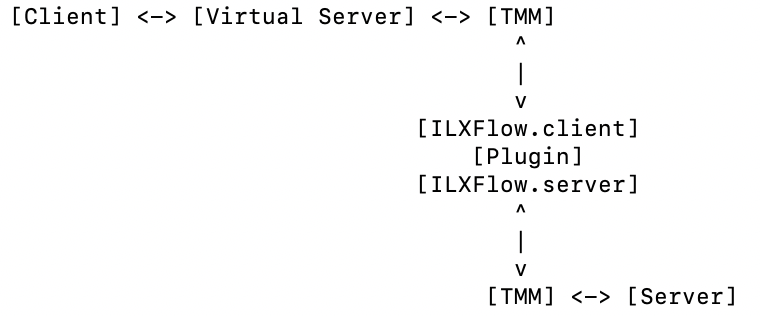

= iRulesLX
:toc: manual

== 什么是 iRulesLX

iRulesLX 利用 Node.js 的能力增强 BIG-IP 在数据平面的可编程性，具体是增强了 iRules 的编程的能力，iRulesLX 提供了一种机制可调运 Node.js 程序，Node.js 位于 BIG-IP 之上，提供一个单线程的环境运行 Node.js 程序。

iRulesLX 有两种模式，具体对比如下表。

[cols="2,5a,5a"]
|===
|对比项 |ILX RPC |ILX Streaming

|实现原理
|TCL iRules 异步调运 Node.js 方法
|通过 ILX profile 给 VS 增加了流数据接口，Node.js 插件扮演的角色类似一个 Proxy

NOTE: Node.js 插件也直接配置相当于一个 Server，Client 端请求通过 Node.js 插件直接返回给 Client 端。

|流量处理
|iRules 负责接收、处理流量，Node.js 不接收流量或修改流量
|Node.js 直接接收和修改流量

|使用场景
|处理少量工作，例如数据库记录
|类似其他 Profile(TCP, SSL, HTTP Compression, Web Acceleration)，或和这些 Profile 配合使用
|===

== 快速开始示例

NOTE: `tmsh help ilx plugin` 命令会有详细命令说明。

=== RPC

[source, bash]
.*1. 创建 ilx workspace 及 extension*
----
create ilx workspace rpc
create ilx workspace rpc extension example
----

[source, bash]
.*2. 执行 `edit ilx workspace rpc extension example` 编辑内容如下*
----
var f5 = require('f5-nodejs');
var server = new f5.ILXServer();
server.addMethod("hello_world", function(req, res) {        
    console.log("request args: " + JSON.stringify(req));
    res.reply('hello_world');
});
server.listen();
----

[source, bash]
.*3. 执行 `edit ilx workspace rpc rule example` 编辑内容如下*
----
when CLIENT_ACCEPTED {
    set plugin [ILX::init rpc example]
    set rv [ILX::call $plugin hello_world arg1 val1 arg2 val2]
    log local0.debug $rv
}
----

[source, bash]
.*4. 创建 ilx plugin*
----
create ilx plugin rpc from-workspace rpc
----

[source, json]
.*5. 关联到 VS 测试*
----
modify ltm virtual http_vs rules { rpc/example } 

// curl access the vs
curl -v http://10.1.10.50/hello

// check from logs
# show sys log ltm range now-1m

Sys::Log
ltm 03-23 05:16:37 info bigipA.f5demo.com sdmd[4182]: pid[15024]  plugin[/Common/rpc.example] request args: {"_id":"1/6","_method":"hello_world","_params":["arg1","val1","arg2","val2"],"_msg":{"jsonrpc":"2.0","id":"1/6","method":"hello_world","params":["arg1","val1","arg2","val2"]}} 
ltm 03-23 05:16:37 debug bigipA tmm1[10045]: Rule /Common/rpc/example <CLIENT_ACCEPTED>: hello_world 
----

[source, bash]
.*6. Clean up*
----
modify ltm virtual http_vs rules none 
delete ilx plugin rpc 
delete ilx workspace rpc 
----

=== Streaming - Data pass through

The following is a sample streaming plugin that acts as a pass through. Data is read from the client and sent to the server. Data is read from the server and sent to the client. 

Note that it is important to handle "error" events as the Node.js plugin process will exit if they are not handled.

[source, bash]
.*1. 创建 ilx workspace 及 extension*
----
create ilx workspace data_pass_through
create ilx workspace data_pass_through extension data_pass_through
----

[source, bash]
.*2. 执行 `edit ilx workspace data_pass_through extension data_pass_through` 编辑内容如下*
----
var f5 = require("f5-nodejs");
var plugin = new f5.ILXPlugin();
           
plugin.on("connect", function(flow) {

    flow.client.on("readable", function() {
        var buffer;
        while (true) {
            buffer = flow.client.read();
            if (buffer === null) {
                break;
            }
            console.log("Client Data");
            console.log(buffer.toString());
            flow.server.write(buffer);
        }
    });
               
    flow.client.on("error", function(err) {
        console.log("client socket error: " + err);
    });

    flow.server.on("readable", function() {
        var buffer;
        while (true) {
            buffer = flow.server.read();
            if (buffer === null) {
                break;
            }
            console.log("Server Data");
            console.log(buffer.toString());
            flow.client.write(buffer);
        }
    });
               
    flow.server.on("error", function(err) {
        console.log("server socket error: " + err);
    });
               
    flow.on("error", function(err) {
        console.log("flow error: " + err);
    });
});
           
var options = new f5.ILXPluginOptions(); 
plugin.start(options);
----

[source, bash]
.*3. 创建 ilx plugin*
----
create ilx plugin data_pass_through from-workspace data_pass_through
modify ilx plugin data_pass_through extensions { data_pass_through { ilx-logging enabled concurrency-mode single } } 
----

[source, bash]
.*4. 创建 profile 关联 ilx extension*
----
create ltm profile ilx streaming-data-passthrough plugin data_pass_through
----

[source, bash]
.*5. 关联 profile 到 VS*
----
modify ltm virtual http_vs profiles add { streaming-data-passthrough } 
----

[source, bash]
.*6. 测试*
----
curl http://10.1.10.50/hello
----

[source, bash]
.*7. Clean up*
----
delete ltm profile ilx streaming-data-passthrough 
delete ilx plugin data_pass_through
delete ilx workspace data_pass_through 
----

=== Streaming - HTTP Data pass through

类似上面示例，本示例 http profile 一起完成工作。 

[source, bash]
.*1. 创建 ilx workspace 及 extension*
----
create ilx workspace http_data_pass_through
create ilx workspace http_data_pass_through extension http_data_pass_through
----

[source, bash]
.*2. 执行 `edit ilx workspace http_data_pass_through extension http_data_pass_through` 编辑内容如下*
----
var f5 = require('f5-nodejs');
var plugin = new f5.ILXPlugin();
           
plugin.on("connect", function(flow)
{
    flow.client.on("requestStart", function(request) {
        console.log("requestStart: " + JSON.stringify(request.params));
    });
    
    flow.client.on("readable", function() {
        var buf;
        while (true) {
            buf = flow.client.read();
            if (buf !== null) {
                console.log("request body:" + buf.length + " bytes");
                console.log(buf.toString());
                flow.server.write(buf);
            } else {
                break;
            }
        }
    });
               
    flow.client.on("requestComplete", function(request) {
        console.log("requestComplete: " + JSON.stringify(request.params));
        request.complete();
    });
               
    flow.client.on("error", function(err) {
        console.error("flow.client error:" + err);
    });

    flow.server.on("responseStart", function(response) {
        console.log("responseStart: " + JSON.stringify(response.params));
    });
               
    flow.server.on("readable", function() {
        var buf;
        while (true) {
            buf = flow.server.read();
            if (buf !== null) {
                console.log("response body:" + buf.length + " bytes");
                console.log(buf.toString());
                flow.client.write(buf);
            } else {
                break;
            }
        }
    });
               
    flow.server.on("responseComplete", function(response) {
        console.log("responseComplete: " + JSON.stringify(response.params));
        response.complete();
    });
               
    flow.server.on("error", function(err) {
        console.error("flow.server error:" + err);
    });
               
    flow.on("error", function(err) {
        console.error("flow.error:" + err);
    });
 });
           
var options = new f5.ILXPluginOptions(); 
plugin.start(options);
----

[source, bash]
.*3. 创建 ilx plugin*
----
create ilx plugin http_data_pass_through from-workspace http_data_pass_through 
modify ilx plugin http_data_pass_through extensions { http_data_pass_through { concurrency-mode single ilx-logging enabled } }
----

[source, bash]
.*4. 创建 profile 关联 ilx extension*
----
create ltm profile ilx streaming-http-data-passthrough plugin http_data_pass_through 
----

[source, bash]
.*5. 关联 profile 到 VS*
----
modify ltm virtual http_vs profiles add { http streaming-http-data-passthrough } 
----

[source, bash]
.*6. 测试*
----
curl "http://10.1.10.50/hello?name=kylin&password=password&data=1231321334342&form=f5demofrom"
----

[source, bash]
.*7. Clean up*
----
modify ltm virtual http_vs profiles delete { http streaming-http-data-passthrough }
delete ltm profile ilx streaming-http-data-passthrough 
delete ilx plugin http_data_pass_through 
delete ilx workspace http_data_pass_through 
----

=== Streaming - HTTP Server

本快速开始示例演示 Node.js 作为 HTTP Server 输出客户端请求和 HTTP BODY 内容。

[source, bash]
.*1. 创建 ilx workspace 及 extension*
----
create ilx workspace http_server
create ilx workspace http_server extension http_server
----

[source, bash]
.*2. 执行 `edit ilx workspace http_server extension http_server` 编辑内容如下*
----
var f5 = require('f5-nodejs');
var plugin = new f5.ILXPlugin();

plugin.on("connect", function(flow)
{

    flow.client.on("data", function(buffer) {
        flow.client.end(
            "HTTP/1.0 200 OK\r\n" +
            "Server: BigIP-ILX-Streaming\r\n" +
            "Connection: Keep-Alive\r\n" + 
            "Content-Length: " + 8 + "\r\n\r\n" + 
            "success\n");
    });
    
 });

var options = new f5.ILXPluginOptions();
options.disableServer = true;
plugin.start(options);
----

[source, bash]
.*3. 创建 ilx plugin*
----
create ilx plugin fakeserver from-workspace http_server
modify ilx plugin fakeserver extensions { http_server { concurrency-mode single ilx-logging enabled } }
----

[source, bash]
.*4. 创建 profile 关联 ilx extension*
----
create ltm profile ilx streaming-http-server plugin fakeserver 
----

[source, bash]
.*5. 关联 profile 到 VS**
----
modify ltm virtual http_vs profiles add { streaming-http-server } 
----

[source, bash]
.*6. 测试*
----
curl "http://10.1.10.50/hello?name=kylin&password=password&data=1231321334342&form=f5demofrom"
----

[source, bash]
.*7. Clean up*
----
modify ltm virtual http_vs profiles delete { streaming-http-server } 
delete ltm profile ilx streaming-http-server 
delete ilx plugin fakeserver
delete ilx workspace http_server
----

=== Streaming - Node.js `http` module

本快速开始示例演示 Node.js `http` module 提供 HTTP 服务。

[source, bash]
.*1. 创建 ilx workspace 及 extension*
----
create ilx workspace node_http_server
create ilx workspace node_http_server extension node_http_server
----

[source, bash]
.*2. 执行 `edit ilx workspace node_http_server extension nodehttp_server` 编辑内容如下*
----
var http = require('http'); 
var f5 = require('f5-nodejs');

function httpRequest(req, res)
{ 
    console.log("client request method: " + req.method)
    console.log("client request URL: " + req.url)
    console.log("client request Headers: " + req.rawHeaders)
    res.writeHead(200, {'Content-Type': 'text/html', 'Server': 'BIG-IP ILX STREAMING'});
    res.end("success\n", "ascii"); 
}

var plugin = new f5.ILXPlugin(); 
plugin.startHttpServer(httpRequest);
----

NOTE: link:https://nodejs.org/api/http.html[https://nodejs.org/api/http.html] 为 `http` module API 文档。

[source, bash]
.*3. 创建 ilx plugin*
----
create ilx plugin node_http_server from-workspace node_http_server
modify ilx plugin node_http_server extensions { node_http_server { concurrency-mode single ilx-logging enabled } }
----

[source, bash]
.*4. 创建 profile 关联 ilx extension*
----
create ltm profile ilx streaming-node-http-server plugin node_http_server
----

[source, bash]
.*5. 关联 profile 到 VS**
----
modify ltm virtual http_vs profiles add { streaming-node-http-server }
----

[source, bash]
.*6. 测试*
----
curl "http://10.1.10.50/hello?name=kylin&password=password&data=1231321334342&form=f5demofrom"
----

[source, bash]
.*7. Clean up*
----
modify ltm virtual http_vs profiles delete { streaming-node-http-server }
delete ltm profile ilx streaming-node-http-server
delete ilx plugin node_http_server
delete ilx workspace node_http_server
----

