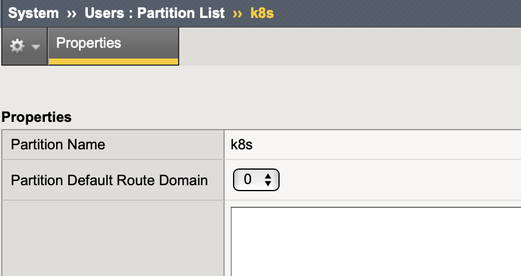
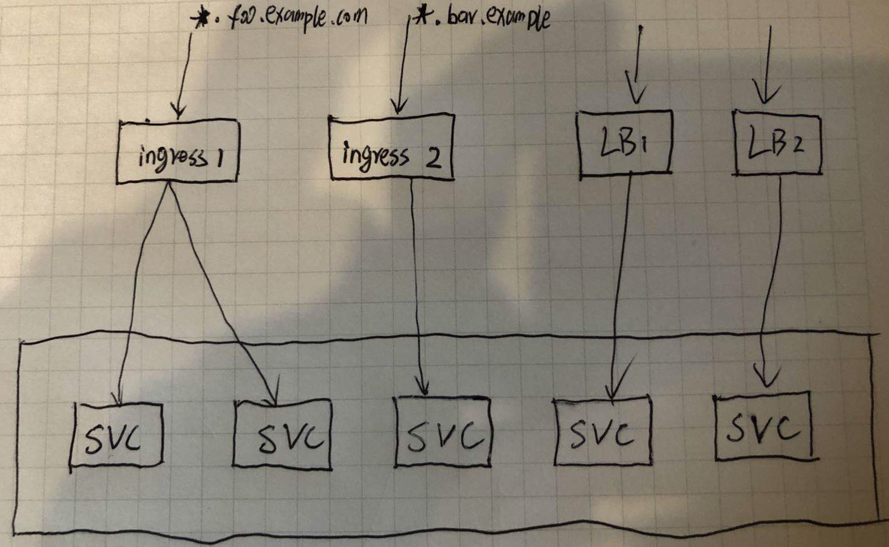

= F5 Container Ingress Services
:toc: manual

== 什么是 CIS

// TODO

== F5 HW/VE 准备

=== F5 HW/VE 准备

准备 F5 HW/VE， 确保可以工作

=== 创建 partition

在 F5 HW/VE 上创建 partition。

`System` -> `Users` -> `Partition List`, 创建名为 k8s 的 partition。

=== AS3 插件安装

使用 https://clouddocs.f5.com/products/extensions/f5-appsvcs-extension/latest/userguide/installation.html[链接] 中提供的三种方法中的任意一种安装 AS3 插件。

[source, json]
.*安装验证*
----
$ curl -k -u admin:admin.F5demo.com https://192.168.1.8/mgmt/shared/appsvcs/info
{
   "version":"3.19.0",
   "release":"4",
   "schemaCurrent":"3.19.0",
   "schemaMinimum":"3.0.0"
}
----

== 安装

下载 yaml 文件：

* link:files/rbac.yaml[rbac.yaml]
* link:files/cis.yaml[cis.yaml]

[source, bash]
.*安装*
----
kubectl create secret generic bigip-login --from-literal=username=admin --from-literal=password=admin.F5demo.com -n kube-system
kubectl create serviceaccount bigip-ctlr -n kube-system
kubectl create -f rbac.yaml
kubectl create -f cis.yaml 
----

[source, bash]
.*安装验证* 
----
kubectl logs -f k8s-bigip-ctlr-c4898b6b6-ccdng -n kube-system
2020/06/08 14:17:44 [INFO] [INIT] Starting: Container Ingress Services - Version: 2.0.0, BuildInfo: cloud-user-efcab9e-20200522033624
2020/06/08 14:17:44 [INFO] ConfigWriter started: 0xc00031e360
2020/06/08 14:17:44 [INFO] Started config driver sub-process at pid: 15
2020/06/08 14:17:44 [INFO] [INIT] Creating Agent for as3
2020/06/08 14:17:44 [INFO] [AS3] Initializing AS3 Agent
2020/06/08 14:17:44 [INFO] [CCCL] Initializing CCCL Agent
2020/06/08 14:17:44 [INFO] [CORE] NodePoller (0xc000350120) registering new listener: 0x130d7c0
2020/06/08 14:17:44 [INFO] [CORE] NodePoller started: (0xc000350120)
2020/06/08 14:17:44 [INFO] [CORE] Watching Ingress resources.
2020/06/08 14:17:44 [INFO] [CORE] Watching ConfigMap resources.
2020/06/08 14:17:44 [INFO] [CORE] Handling ConfigMap resource events.
2020/06/08 14:17:44 [INFO] [CORE] Handling Ingress resource events.
2020/06/08 14:17:44 [INFO] [CORE] Registered BigIP Metrics
2020/06/08 14:17:44 [INFO] [CCCL] Successfully Sent the FDB Records
2020/06/08 14:17:45 [INFO] [2020-06-08 14:17:45,561 __main__ INFO] entering inotify loop to watch /tmp/k8s-bigip-ctlr.config240116962/config.json
----

== flannel VXLAN 集成

如果 Kubernets 使用 flannel 网络插件，则需要配置本部分。

[source, bash]
.*1. 查看每个节点上部署的 flannel 容器*
----
$ kubectl get pods -n kube-system -o wide | grep flannel | awk '{print $1, $2, $3, $6, $7}'
kube-flannel-ds-amd64-fw2lb 1/1 Running 192.168.122.101 master01.example.com
kube-flannel-ds-amd64-lthp4 1/1 Running 192.168.122.102 worker01.example.com
kube-flannel-ds-amd64-mg5d5 1/1 Running 192.168.122.103 worker02.example.com
----

----
4: flannel.1: <BROADCAST,MULTICAST,UP,LOWER_UP> mtu 1450 qdisc noqueue state UNKNOWN group default 
    link/ether 96:d5:4c:c0:13:f2 brd ff:ff:ff:ff:ff:ff
    inet 10.244.0.0/32 scope global flannel.1
       valid_lft forever preferred_lft forever
    inet6 fe80::94d5:4cff:fec0:13f2/64 scope link 
       valid_lft forever preferred_lft forever

4: flannel.1: <BROADCAST,MULTICAST,UP,LOWER_UP> mtu 1450 qdisc noqueue state UNKNOWN group default 
    link/ether ea:22:ec:be:f0:b8 brd ff:ff:ff:ff:ff:ff
    inet 10.244.1.0/32 scope global flannel.1
       valid_lft forever preferred_lft forever
    inet6 fe80::e822:ecff:febe:f0b8/64 scope link 

4: flannel.1: <BROADCAST,MULTICAST,UP,LOWER_UP> mtu 1450 qdisc noqueue state UNKNOWN group default 
    link/ether de:cd:7d:be:be:cf brd ff:ff:ff:ff:ff:ff
    inet 10.244.2.0/32 scope global flannel.1
       valid_lft forever preferred_lft forever
    inet6 fe80::dccd:7dff:febe:becf/64 scope link 
       valid_lft forever preferred_lft forever
----

[source, bash]
.*2. 创建 VXLAN tunnel*
----
create net tunnels vxlan fl-vxlan port 8472 flooding-type none
create net tunnels tunnel flannel_vxlan key 1 profile fl-vxlan local-address 10.1.10.248
create net self 10.244.3.240 address 10.244.3.240/24 vlan flannel_vxlan allow-service none
create net self 10.244.3.241 address 10.244.3.241/24 vlan flannel_vxlan allow-service none traffic-group traffic-group-1 
----

[source, bash]
.*3. 查看 BIG-IP Tunnel MAC 地址*
----
show net tunnels tunnel flannel_vxlan all-properties | grep "MAC Address"
MAC Address                     00:0c:29:56:a0:b8
----

NOTE: `00:0c:29:56:a0:b8` is the Mac address of BIG-IP Tunnel flannel_vxlan.

[source, bash]
.*4. 查看 K8S 各节点上 Flannel Annotation*
----
$ kubectl describe nodes | grep flannel
Annotations:        flannel.alpha.coreos.com/backend-data: {"VtepMAC":"96:d5:4c:c0:13:f2"}
                    flannel.alpha.coreos.com/backend-type: vxlan
                    flannel.alpha.coreos.com/kube-subnet-manager: true
                    flannel.alpha.coreos.com/public-ip: 192.168.122.101

Annotations:        flannel.alpha.coreos.com/backend-data: {"VtepMAC":"ea:22:ec:be:f0:b8"}
                    flannel.alpha.coreos.com/backend-type: vxlan
                    flannel.alpha.coreos.com/kube-subnet-manager: true
                    flannel.alpha.coreos.com/public-ip: 192.168.122.102

Annotations:        flannel.alpha.coreos.com/backend-data: {"VtepMAC":"de:cd:7d:be:be:cf"}
                    flannel.alpha.coreos.com/backend-type: vxlan
                    flannel.alpha.coreos.com/kube-subnet-manager: true
                    flannel.alpha.coreos.com/public-ip: 192.168.122.103
----

[source, yaml]
.*5. 创建一个 BIG-IP K8S 节点*
----
// yaml
cat <<EOF > ./big-ip-node.yaml
apiVersion: v1
kind: Node
metadata:
  name: bigip
  annotations:
    # Provide the MAC address of the BIG-IP VXLAN tunnel
    flannel.alpha.coreos.com/backend-data: '{"VtepMAC":"00:0c:29:56:a0:b8"}'
    flannel.alpha.coreos.com/backend-type: "vxlan"
    flannel.alpha.coreos.com/kube-subnet-manager: "true"
    # Provide the IP address you assigned as the BIG-IP VTEP
    flannel.alpha.coreos.com/public-ip: 10.1.10.248
spec:
  # Define the flannel subnet you want to assign to the BIG-IP device.
  # Be sure this subnet does not collide with any other Nodes' subnets.
  podCIDR: 10.244.3.0/24
EOF

// create
kubectl create -f big-ip-node.yaml 
----

== CIS + CCCL

=== L4 Mysql 服务

*YAML 下载*

* link:files/mysql/mysql.yaml[mysql.yaml]
* link:files/mysql/cm.yaml[cm.yaml]

[source, yaml]
.*步骤*
----
kubectl create ns test001
kubectl create -f mysql.yaml
kubectl create -f cm.yaml 

// clear up
kubectl delete -f cm.yaml
----

[source, yaml]
.*测试*
----
mysql -h10.1.10.60 -uroot -pf5demo666 -P3306
----

=== L7 HTTP REST 服务

*YAML 下载*

* link:files/rest/rest.yaml[rest.yaml]
* link:files/rest/cm.yaml[cm.yaml]

[source, yaml]
.*步骤*
----
kubectl create ns test002
kubectl create -f rest.yaml 
kubectl create -f cm.yaml

// clear up
kubectl delete -f cm.yaml
----

[source, yaml]
.*4. 测试* 
----
curl http://10.1.10.61/foo
----

== CIS + AS3

=== 基于 cookie 的会话保持

*YAML 脚本* 

* link:files/001/deploy.yaml[deploy.yaml]   
* link:files/001/cm.yaml[cm.yaml]   
* link:files/001/cm-blank.yaml[cm-blank.yaml]

[source, bash]
.*步骤*
----
kubectl create ns f5-test001
kubectl create -f deploy.yaml 
kubectl apply -f cm.yaml

// clear up
kubectl apply -f cm-blank.yaml 
kubectl delete ns f5-test001
----

=== 一个租户下多个 App

*YAML 脚本*

* link:files/002/deploy.yaml[deploy.yaml]
* link:files/002/cm.yaml[cm.yaml]
* link:files/002/cm-blank.yaml[cm-blank.yaml] 

[source, bash]
.*步骤*
----
kubectl create ns f5-test002
kubectl create -f deploy.yaml
kubectl apply -f cm.yaml

kubectl apply -f cm-blank.yaml
kubectl delete ns f5-test002
----

=== 两个 App 共享一个 Pool

*YAML 脚本*

* link:files/003/deploy.yaml[deploy.yaml]
* link:files/003/cm.yaml[cm.yaml]
* link:files/003/cm-blank.yaml[cm-blank.yaml]

[source, bash]
.*步骤*
----
kubectl create ns f5-test003
kubectl create -f deploy.yaml
kubectl apply -f cm.yaml

kubectl apply -f cm-blank.yaml
kubectl delete ns f5-test003
----

=== 一个 APP 内多个服务

*YAML 脚本*

* link:files/004/deploy.yaml[deploy.yaml]
* link:files/004/cm.yaml[cm.yaml]
* link:files/004/cm-blank.yaml[cm-blank.yaml]

[source, bash]
.*步骤*
----
kubectl create ns f5-test004
kubectl create -f deploy.yaml
kubectl apply -f cm.yaml

kubectl apply -f cm-blank.yaml
kubectl delete ns f5-test004
----

== CIS + IAPP

[source, bash]
.*步骤*
----

----

== Ingress

=== 多模式配合下发

如下图，K8S 中有 5 个 Service，前两个 Service 通过 Ingress 1 发布，第三个 Service 通过 Ingress 2 发布，最后两个 Service 通过 AS 3 负载均衡发布。

.*YAML 文件描述*
|===
|YAML |DESC

|link:yaml/001/cis.yaml[cis.yaml]
|CIS Controller 部署

|link:yaml/001/deploy.yaml[deploy.yaml]
|部署 5 个 App 及 5 个 Service

|link:yaml/001/in01.yaml[in01.yaml]
|部署 Ingress 1

|link:yaml/001/in02.yaml[in02.yaml]
|部署 Ingress 2

|link:yaml/001/cm.yaml[cm.yaml]
|AS 3 下发模板

|===

[source, bash]
.*步骤*
----
kubectl create -f deploy.yaml
kubectl create -f in01.yaml
kubectl create -f in02.yaml
kubectl create -f cm.yaml
----

=== TD

*YAML 脚本*

*

[source, bash]
.*步骤*
----

----

*YAML 脚本*

*

[source, bash]
.*步骤*
----

----

*YAML 脚本*

*

[source, bash]
.*步骤*
----

----

*YAML 脚本*

*

[source, bash]
.*步骤*
----

----

*YAML 脚本*

*

[source, bash]
.*步骤*
----

----

== 常见问题

=== AS3 REST call error

The `k8s-bigip-ctlr` container throws the following error:

[source, bash]
----
2020/05/18 08:10:55 [ERROR] [AS3] REST call error: Post https://10.1.1.245/mgmt/shared/appsvcs/declare/: dial tcp 10.1.1.245:443: connect: no route to host 
2020/05/18 08:11:06 [ERROR] [2020-05-18 08:11:06,874 __main__ ERROR] Encountered error: BIG-IP connection error: HTTPSConnectionPool(host='10.1.1.245', port=443): Max retries exceeded with url: /mgmt/shared/authn/login (Caused by NewConnectionError('<urllib3.connection.VerifiedHTTPSConnection object at 0x7fb4a6e52588>: Failed to establish a new connection: [Errno 113] No route to host',)). Retrying for 16 seconds.
2020/05/18 08:11:26 [ERROR] [AS3] REST call error: Post https://10.1.1.245/mgmt/shared/appsvcs/declare/: dial tcp 10.1.1.245:443: connect: no route to host 
2020/05/18 08:11:40 [ERROR] [2020-05-18 08:11:40,950 __main__ ERROR] Encountered error: BIG-IP connection error: HTTPSConnectionPool(host='10.1.1.245', port=443): Max retries exceeded with url: /mgmt/shared/authn/login (Caused by NewConnectionError('<urllib3.connection.VerifiedHTTPSConnection object at 0x7fb4a6e613c8>: Failed to establish a new connection: [Errno 113] No route to host',)). Retrying for 32 seconds.
2020/05/18 08:11:57 [ERROR] [AS3] REST call error: Post https://10.1.1.245/mgmt/shared/appsvcs/declare/: dial tcp 10.1.1.245:443: connect: no route to host 
2020/05/18 08:12:28 [ERROR] [AS3] REST call error: Post https://10.1.1.245/mgmt/shared/appsvcs/declare/: dial tcp 10.1.1.245:443: connect: no route to host 
2020/05/18 08:12:47 [ERROR] [2020-05-18 08:12:47,106 __main__ ERROR] Encountered error: BIG-IP connection error: HTTPSConnectionPool(host='10.1.1.245', port=443): Max retries exceeded with url: /mgmt/shared/authn/login (Caused by NewConnectionError('<urllib3.connection.VerifiedHTTPSConnection object at 0x7fb4a6e52fd0>: Failed to establish a new connection: [Errno 113] No route to host',)). Retrying for 64 seconds.
2020/05/18 08:12:59 [ERROR] [AS3] REST call error: Post https://10.1.1.245/mgmt/shared/appsvcs/declare/: dial tcp 10.1.1.245:443: connect: no route to host 
----

*Root Cause & Solutions*

The firewall on K8S node reject container request. Either set firewall rule, or stop firewall can solve this problem.

=== Unable to get list of nodes

[source, bash]
----
2020/05/04 11:15:59 [WARNING] Unable to get list of nodes, err=Get https://10.96.0.1:443/api/v1/nodes: dial tcp 10.96.0.1:443: i/o timeout
E0504 11:16:16.402498    1 reflector.go:126] github.com/F5Networks/k8s-bigip-ctlr/pkg/appmanager/appManager.go:785: Failed to list *v1.Endpoints: Get https://10.96.0.1:443/api/v1/endpoints?limit=500&resourceVersion=0: dial tcp 10.96.0.1:443: i/o timeout
E0504 11:16:16.405417    1 reflector.go:126] github.com/F5Networks/k8s-bigip-ctlr/pkg/appmanager/appManager.go:797: Failed to list *v1.Node: Get https://10.96.0.1:443/api/v1/nodes?limit=500&resourceVersion=0: dial tcp 10.96.0.1:443: i/o timeout
E0504 11:16:16.408175    1 reflector.go:126] github.com/F5Networks/k8s-bigip-ctlr/pkg/appmanager/appManager.go:782: Failed to list *v1.Service: Get https://10.96.0.1:443/api/v1/services?limit=500&resourceVersion=0: dial tcp 10.96.0.1:443: i/o timeout
E0504 11:16:16.411074    1 reflector.go:126] github.com/F5Networks/k8s-bigip-ctlr/pkg/appmanager/appManager.go:782: Failed to list *v1.Service: Get https://10.96.0.1:443/api/v1/services?labelSelector=cis.f5.com%2Fas3-app%2Ccis.f5.com%2Fas3-pool%2Ccis.f5.com%2Fas3-tenant&limit=500&resourceVersion=0: dial tcp 10.96.0.1:443: i/o timeout
E0504 11:16:16.412725    1 reflector.go:126] github.com/F5Networks/k8s-bigip-ctlr/pkg/appmanager/appManager.go:788: Failed to list *v1beta1.Ingress: Get https://10.96.0.1:443/apis/extensions/v1beta1/ingresses?limit=500&resourceVersion=0: dial tcp 10.96.0.1:443: i/o timeout
E0504 11:16:16.419296    1 reflector.go:126] github.com/F5Networks/k8s-bigip-ctlr/pkg/appmanager/appManager.go:785: Failed to list *v1.Endpoints: Get https://10.96.0.1:443/api/v1/endpoints?limit=500&resourceVersion=0: dial tcp 10.96.0.1:443: i/o timeout
E0504 11:16:16.422460    1 reflector.go:126] github.com/F5Networks/k8s-bigip-ctlr/pkg/appmanager/appManager.go:794: Failed to list *v1.ConfigMap: Get https://10.96.0.1:443/api/v1/configmaps?labelSelector=f5type+in+%28virtual-server%29&limit=500&resourceVersion=0: dial tcp 10.96.0.1:443: i/o timeout
E0504 11:16:16.428132    1 reflector.go:126] github.com/F5Networks/k8s-bigip-ctlr/pkg/appmanager/appManager.go:794: Failed to list *v1.ConfigMap: Get https://10.96.0.1:443/api/v1/configmaps?labelSelector=as3+in+%28true%29%2Cf5type+in+%28virtual-server%29&limit=500&resourceVersion=0: dial tcp 10.96.0.1:443: i/o timeout
----

*Root Cause & Solutions*

The AS3 can not request to CIS Container, the following may cause this:

* Network connectivity, BIG-IP VE can not access the k8s pod, correct the network connectivity can solve this issue.
* K8S is Hang or out of service, wait the K8S back to service, like increase the resource provisioning.

=== Error validating AS3 template

[source, bash]
----
2020/06/04 02:28:19 [ERROR] [AS3] Error validating AS3 template
2020/06/04 02:28:19 [ERROR] [AS3] Error while processing user defined AS3 cfgMap Name: app-as3
----

*Root Cause & Solutions*

