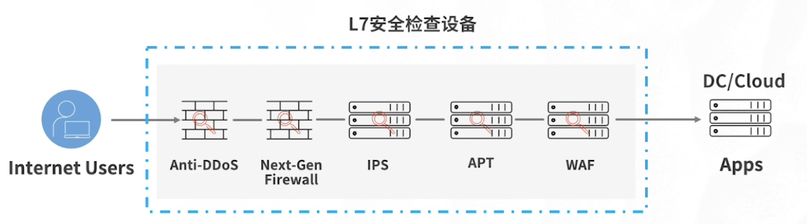
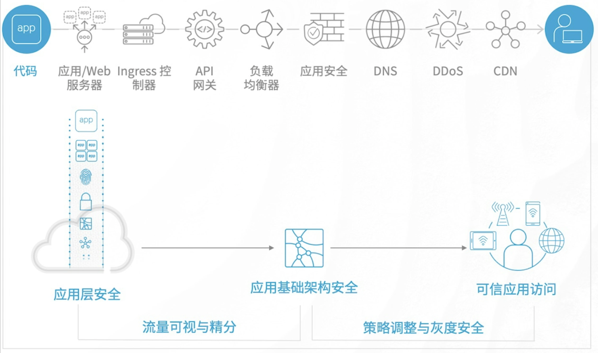
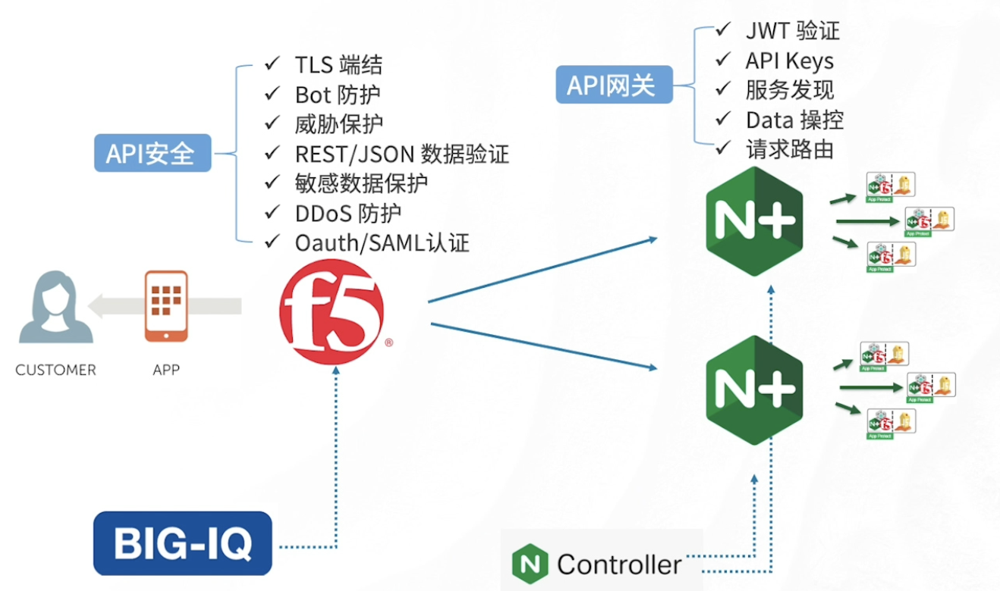

= 应用安全	
:toc: manual

== 安全无界，应用为先

通过构建面向应用的零信任架构，增强应用安全防护；借助AI、大数据分析以及全面的安全生态体系，简化复杂的安全模型，助企业受益及获利于应用安全。

=== 应用安全现状

目前企业和组织应对安全主要有两个方面的挑战：

* 第一是缺乏安全技能，根据 F5 发布的《2020 年应用服务现状》，71% 的企业或组织面临安全技能的短缺，其中应用安全相关的短板最为明显。如何借助AI、大数据分析构建全面的安全生态体系？如何针对微服务、API、分布式应用做安全加固？多云环境下安全挑战如何应对？这都需要在安全技能上需要加强；
* 其次是*架构上对应用安全能力的束缚*，传统安全架构如下所示：

传统安全架构面临的巨大挑战可总结为如下几点：

* 安全设备与网络紧耦合，紧耦合意味着牵一发而动全身，任何安全策略的调整都有可能对网络流量造成较大的影响，这种场景下，企业和组织落地应用安全策略就很难。
* 所有流量经过所有设备导致噪音
* 安全设备难以增删
* 策略不敢轻易调整，应用安全策略不容易添加
* 安全设备扩容只能做整体替换
* 运维和排障成本高

=== F5 应用安全框架

首先，从应用视角看到的威胁与风险有哪些呢？

1. 访问层面的攻击，会话劫持、撞库、暴力破解、钓鱼
2. 应用基础架构攻击， DDoS、加密绕行、中间人、DNS 欺诈与隧道
3. 应用内容攻击，L7 DDoS、API 攻击、SQL/PHP 注入、XSS、CSRF
4. 混合攻击，APT、多云威胁、恶意机器人、威胁情报和恶意代码
5. 可视化风险，加密数据、数据噪音、流量调度
6. 安全策略风险，固化的安全策略、强合规弱对抗
7. 态势感知风险，日志执行、策略执行点、可扩展安全模型
8. 业务风险，业务安全分界、防欺诈

* 首先是可信应用访问，要确保从客户端到代码的访问的过程中是经过认证授权，经过非常强的业务加密保护；
** 零信任架构 - 从不信任、永远效验、持续监控

* 其次是应用基础架构安全，应用基础架构安全也是非常重要的，例如从整个代码到客户的过程中，不能因为有 DNS 的隧道，不能因为有加密的攻击导致应用基础架构安全出现问题；
** DNS 安全
** IOT 访问控制
** 加密服务
** IPS
** NAT
** 威胁情报
** DDOS 防护

* 同样需要关注应用层内容的安全，同时需要应用基础架构到应用层内容安全流量可视与精分，可信访问策略可调整支持灰度发布。
** OWASP Top 10
** 机器人防御 - BOT 特征，DNS 检查，客户端挑战，浏览器指纹，行为识别
** AWASP API 安全

=== 应用安全服务

* 流量可视与精分 - 针对双向 SSL/TLS 加密流量的安全业务优化调度，通过上下文分类引擎、丰富的流量选择、基于策略的解密和流量调度、Bypass，阻断，检测等多种行为、高级业务监控和可扩展
* DevSecOps - DevSecOps 是未来趋势，它的核心是“近源防护”，应用防护伴随应用开发的整个生命周期，Nginx App Protect 是关键的产品实现 DevSecOps
* 智能安全威胁服务 - 基于 AI，例如 Shape 的独特优势包括：收集专有信号、通过机器学习执行实时数据分类、广泛的数据集和机器学习训练、全面的高级攻击缓解

== 双模安全架构

双模安全强调的是一个合规与对抗并存的方式。

=== 双模安全概览

安全架构的演进经历了一下几个阶段

*传统三层安全架构：*

1. 防火墙
2. IPS/IDS
3. WAF

这种三层铁三角架构是一个合规型的架构，但在这个架构上作出攻击阻断的能力不多。

*双层安全架构：*

1. 四层策略区 - 四层是一个层层过滤
2. 七层策略区 - 策略型

*双模安全：*

1. 

== SSLO 方案

SSLO 主要解决的是传统安全架构对现代安全需求（应用安全）所带来的束缚问题。

随着网络的发展，现代互联网正在逐渐步入全站 HTTPS 时代。 

数据中心互联网接入区中均部署有安全设备，主备模式部署设备利用率低。由于传统安全设备在处理SSL流量的时候存在无法进行SSL加解密或SSL加解密性能差等问题，存在安全盲点。另外在众多安全设备糖葫芦串部署模式下存在整体稳定性低等问题，F5 的 SSLO 解决方案可以有效解决该问题，实现：

* 数据流整体实现一次SSL加解密，降低应用访问延迟, 消除安全盲点。
* 安全设备资源池化，提升资源利用率，实现弹性伸缩。同时在安全设备池整体故障时，F5可实现流量bypass，提升整体架构高可用性。
* 自定义安全服务链，编排不同的业务流量经过不同的安全服务链，实现业务流量的针对性防护，提升安全设备的利用率。

